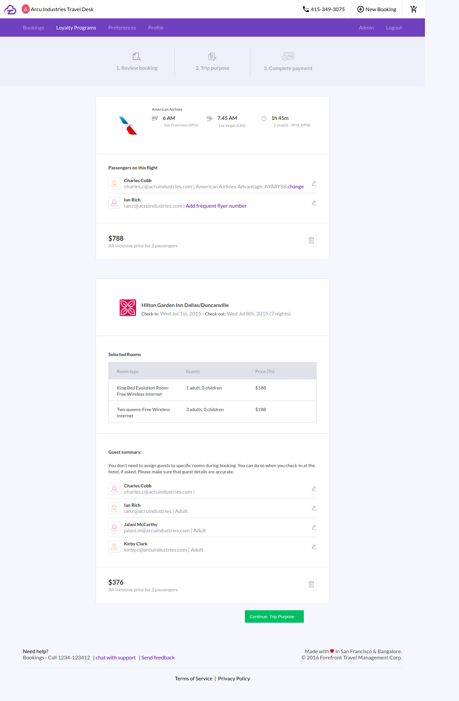

# Css Flexbox Layout Module

Flexbox is a layout model that allows elements to align and distribute space within a container.This is a webpage built in css flexbox module.

<b>Screenshots</b>  
<kbd>

</kbd>
